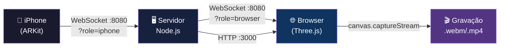

# FaceToModel — Second Brain 🎭

> Sistema de captura facial em tempo real que transmite blendshapes do ARKit de um iPhone para um navegador web, animando personagens 3D com precisão de expressão.

---

## 🗺️ Navegação

### 📋 Fundamentos
- [[01 - Visão Geral]] — O que é o projeto, casos de uso e stack técnica
- [[02 - Arquitetura do Sistema]] — Diagrama completo, fluxo de dados e topologia de rede

### 🛠️ Instalação e Configuração
- [[03 - Setup e Instalação]] — Guia passo a passo para colocar tudo no ar

### 🧩 Componentes
- [[04 - Servidor Node.js]] — Servidor WebSocket relay e protocolo de mensagens
- [[05 - Frontend Web (Three.js)]] — Interface web, renderização 3D e gravação
- [[06 - App iOS (ARKit)]] — Captura facial no iPhone e envio via WebSocket

### 🎨 Referência Técnica
- [[07 - Blendshapes ARKit]] — Tabela completa dos 52 blendshapes faciais
- [[08 - Modelos 3D]] — Requisitos de modelos, fontes e compatibilidade

### 🎬 Funcionalidades
- [[09 - Gravação de Vídeo]] — Gravação de vídeo com áudio via MediaRecorder API

### 🔧 Suporte
- [[10 - Troubleshooting]] — Problemas comuns e soluções

---

## ✅ Status do Projeto

### Infraestrutura
- [x] Servidor Node.js com WebSocket relay
- [x] Protocolo de mensagens JSON definido
- [x] Porta HTTP :3000 (frontend)
- [x] Porta WebSocket :8080 (relay)

### App iOS
- [x] Captura ARFaceTrackingConfiguration
- [x] Extração dos 52 blendshapes
- [x] Envio via URLSessionWebSocketTask
- [x] Throttling a 30fps

### Frontend Web
- [x] Renderização Three.js com modelo GLB
- [x] Recepção de dados WebSocket
- [x] Mapeamento blendshape → morph targets
- [x] Gravação de vídeo (MediaRecorder)
- [ ] Suporte a múltiplos modelos simultâneos
- [ ] Interface de calibração de blendshapes

---

## ⚡ Arquitetura Rápida

---

## 🔗 Links Externos

| Recurso | URL |
|---|---|
| ARKit Face Tracking Docs | https://developer.apple.com/documentation/arkit/arfaceanchor |
| Three.js Documentação | https://threejs.org/docs/ |
| Ready Player Me (modelos) | https://readyplayer.me |
| glTF Viewer (verificar morph targets) | https://gltf-viewer.donmccurdy.com |
| MediaRecorder API (MDN) | https://developer.mozilla.org/en-US/docs/Web/API/MediaRecorder |
| FACS (Wikipedia) | https://en.wikipedia.org/wiki/Facial_Action_Coding_System |
