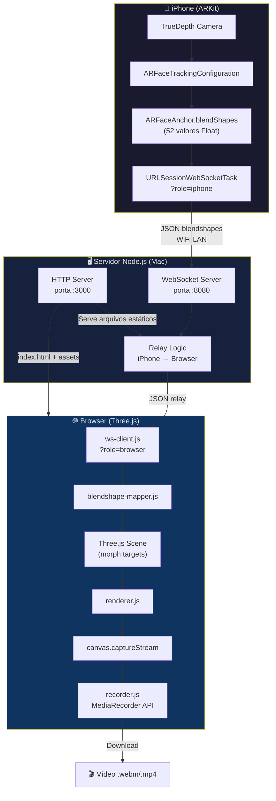
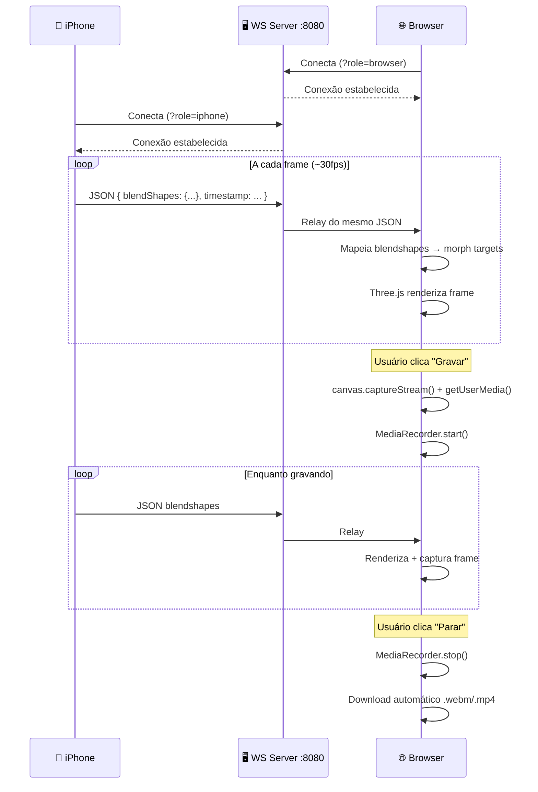
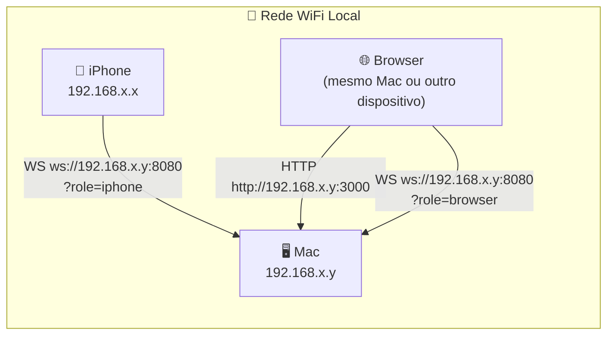

# 02 — Arquitetura do Sistema

> [!NOTE] Este documento descreve a arquitetura completa do FaceToModel: componentes, fluxo de dados e topologia de rede. Para configurar o ambiente, veja [[03 - Setup e Instalação]].

---

## 🗺️ Diagrama de Arquitetura

---

## 🔄 Diagrama de Sequência

---

## 📊 Responsabilidades dos Componentes

| Componente | Arquivo(s) | Responsabilidade |
|---|---|---|
| **App iOS** | `ios/FaceToModel/` | Captura facial ARKit → serializa blendshapes → envia via WS |
| **Servidor HTTP** | `server/server.js` | Serve arquivos estáticos do `web/` na porta :3000 |
| **Servidor WebSocket** | `server/server.js` | Relay de mensagens iPhone → browser na porta :8080 |
| **WS Client** | `web/js/ws-client.js` | Conecta ao servidor WS e recebe JSON de blendshapes |
| **Blendshape Mapper** | `web/js/blendshape-mapper.js` | Traduz nomes ARKit → nomes de morph targets do modelo |
| **Renderer** | `web/js/renderer.js` | Loop de renderização Three.js e controles de câmera |
| **Recorder** | `web/js/recorder.js` | Gravação via MediaRecorder + áudio do microfone |

---

## 🌐 Topologia de Rede

> [!IMPORTANT] iPhone e Mac **devem estar na mesma rede WiFi**. O iPhone precisa do IP do Mac para conectar ao servidor. Verifique em **Preferências do Sistema → Rede**.

---

## 🔌 Referência de Portas

| Porta | Protocolo | Uso | Quem Conecta |
|---|---|---|---|
| **:3000** | HTTP | Serve o frontend web (`web/`) | Browser |
| **:8080** | WebSocket | Relay de blendshapes | iPhone + Browser |

> [!TIP] As portas podem ser alteradas nas constantes no topo de `server/server.js`. Lembre de atualizar o app iOS e o `ws-client.js` também.

---

## 🔗 Veja Também

- [[04 - Servidor Node.js]] — Protocolo de mensagens e lógica de relay
- [[05 - Frontend Web (Three.js)]] — Módulos do frontend
- [[06 - App iOS (ARKit)]] — Implementação do app iPhone
- [[10 - Troubleshooting]] — Problemas de conectividade
