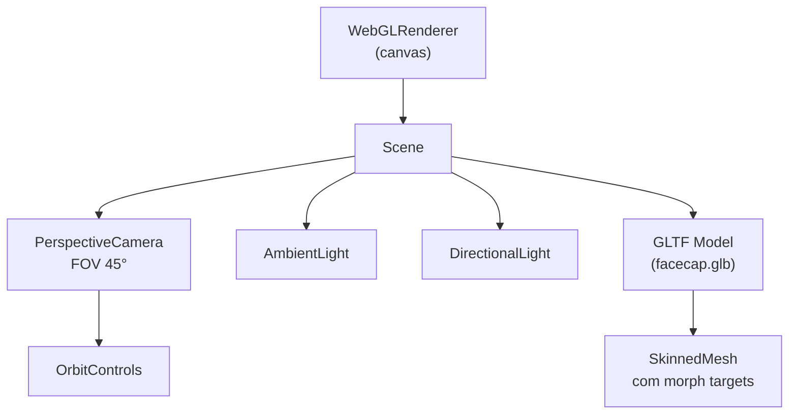

# 05 — Frontend Web (Three.js)

> [!NOTE] O frontend web é servido pelo [[04 - Servidor Node.js]] na porta :3000 e recebe dados de blendshapes via WebSocket. Para detalhes dos blendshapes, veja [[07 - Blendshapes ARKit]].

---

## 📁 Estrutura de Arquivos

```
web/
├── index.html                  ← Ponto de entrada HTML
├── js/
│   ├── main.js                 ← Inicialização e orquestração
│   ├── renderer.js             ← Cena Three.js e loop de renderização
│   ├── ws-client.js            ← Cliente WebSocket
│   ├── blendshape-mapper.js    ← Mapeamento ARKit → morph targets
│   └── recorder.js             ← Gravação de vídeo com áudio
└── models/
    └── facecap.glb             ← Modelo 3D padrão (baixado pelo setup.sh)
```

---

## 🧩 Descrição dos Módulos

### `main.js` — Inicialização e Orquestração
- Ponto de entrada da aplicação
- Instancia e conecta todos os módulos
- Gerencia o estado global (conectado, gravando, etc.)
- Lida com eventos da UI (botões de gravar, pausar, etc.)

### `renderer.js` — Cena Three.js
- Configura a cena (`THREE.Scene`), câmera (`PerspectiveCamera`) e renderer (`WebGLRenderer`)
- Carrega o modelo GLB via `GLTFLoader`
- Configura iluminação (ambient + directional lights)
- Configura OrbitControls para navegação manual da câmera
- Executa o loop de animação via `requestAnimationFrame`
- Expõe método `applyBlendShapes(data)` para atualizar morph targets

### `ws-client.js` — Cliente WebSocket
- Conecta ao servidor com `?role=browser`
- Parseia mensagens JSON recebidas
- Chama callback com objeto `blendShapes` para cada frame
- Implementa reconexão automática em caso de desconexão
- Atualiza indicador visual de status de conexão

```javascript
// Exemplo de uso
const ws = new WSClient('ws://192.168.1.100:8080?role=browser');
ws.onBlendShapes = (data) => {
  renderer.applyBlendShapes(data.blendShapes);
};
```

### `blendshape-mapper.js` — Mapeamento de Blendshapes
- Dicionário de tradução: nome ARKit → nome do morph target no modelo
- Exemplo: `"eyeBlinkLeft"` → `"eyeBlink_L"` (para `facecap.glb`)
- Permite suportar diferentes modelos com convenções de nomenclatura distintas
- Filtro de blendshapes não mapeados (evita erros no console)

> [!IMPORTANT] Cada modelo 3D pode ter nomes de morph targets diferentes. O `blendshape-mapper.js` é o único arquivo que precisa ser modificado para suportar um novo modelo. Veja [[07 - Blendshapes ARKit]] e [[08 - Modelos 3D]].

### `recorder.js` — Gravação de Vídeo
- Captura o canvas Three.js via `canvas.captureStream(30)`
- Captura áudio do microfone via `navigator.mediaDevices.getUserMedia`
- Combina vídeo + áudio via `MediaStream`
- Grava com `MediaRecorder`
- Ao parar, gera download automático do arquivo
- Veja [[09 - Gravação de Vídeo]] para detalhes completos

---

## 🎬 Configuração da Cena Three.js



---

## 🔄 Como o Mapeamento de Blendshapes Funciona

1. **Recepção:** `ws-client.js` recebe JSON `{ blendShapes: { eyeBlinkLeft: 0.8, ... } }`
2. **Mapeamento:** `blendshape-mapper.js` converte `"eyeBlinkLeft"` → `"eyeBlink_L"`
3. **Aplicação:** `renderer.js` encontra o morph target pelo nome no mesh e define o valor:
   ```javascript
   mesh.morphTargetInfluences[morphIndex] = value;
   ```
4. **Renderização:** O loop de animação renderiza o frame com os morph targets atualizados

---

## 📐 Requisitos do Modelo GLB

Para que o modelo seja animado corretamente:

- ✅ Deve conter um `SkinnedMesh` com morph targets (blend shapes)
- ✅ Os morph targets devem ter nomes mapeáveis pelo `blendshape-mapper.js`
- ✅ Formato: `.glb` ou `.gltf` com texturas embutidas
- ✅ Escala e orientação compatíveis (Y-up, unidade em metros recomendada)

Veja [[08 - Modelos 3D]] para fontes de modelos e como verificar morph targets.

---

## 🌐 Compatibilidade de Browsers

| Browser | WebSocket | MediaRecorder | Formato de Saída |
|---|---|---|---|
| **Chrome** (recomendado) | ✅ | ✅ | `.webm` (VP8/VP9) |
| **Firefox** | ✅ | ✅ | `.webm` |
| **Safari** | ✅ | ✅ (iOS 14.5+) | `.mp4` (H.264) |
| **Edge** | ✅ | ✅ | `.webm` |

> [!WARNING] Para usar `getUserMedia` (microfone) em contexto não-localhost, o servidor **deve usar HTTPS**. Em localhost, HTTP é suficiente.

---

## 🔗 Veja Também

- [[07 - Blendshapes ARKit]] — Tabela completa dos 52 blendshapes e seus mapeamentos
- [[08 - Modelos 3D]] — Fontes de modelos compatíveis e como verificá-los
- [[09 - Gravação de Vídeo]] — Detalhes da funcionalidade de gravação
