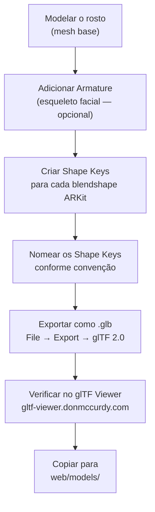

# 08 — Modelos 3D

> [!NOTE] Para que a animação funcione, o modelo 3D deve ter morph targets compatíveis com os blendshapes ARKit. Veja [[07 - Blendshapes ARKit]] para a lista completa de blendshapes necessários.

---

## ✅ Requisitos do Modelo

Para ser animado pelo FaceToModel, um modelo 3D deve:

1. **Formato:** `.glb` ou `.gltf` (com texturas embutidas para `.glb`)
2. **Morph Targets:** Pelo menos os principais dos 52 blendshapes ARKit
3. **Mesh:** Deve conter um `SkinnedMesh` ou `Mesh` com morph targets definidos
4. **Nomes:** Nomes dos morph targets devem estar mapeados em `blendshape-mapper.js`
5. **Escala:** Qualquer escala é aceita (ajustável via Three.js)

> [!TIP] Quanto mais morph targets ARKit o modelo tiver, mais expressiva será a animação. Um modelo com apenas `eyeBlinkLeft/Right` e `jawOpen` já funciona, mas ficará limitado.

---

## 🎭 Modelo Padrão: facecap.glb

O modelo padrão incluído no projeto é o `facecap.glb` dos exemplos oficiais do Three.js:

- **Fonte:** [Three.js Examples — FaceCap](https://threejs.org/examples/#webgl_morphtargets_face)
- **Download pelo setup.sh** automaticamente
- **Localização:** `web/models/facecap.glb`
- **Cobertura:** Todos os 52 blendshapes ARKit
- **Convenção de nomenclatura:** `eyeBlink_L`, `jawOpen`, etc. (com underscore + L/R)

Este modelo é ideal para testes e desenvolvimento pois tem cobertura completa dos blendshapes ARKit.

---

## 🌐 Fontes de Modelos Compatíveis

### Ready Player Me

**URL:** https://readyplayer.me

Plataforma gratuita de avatares personalizados com suporte nativo a ARKit.

**Como obter um modelo com blendshapes ARKit:**
1. Crie ou customize seu avatar em readyplayer.me
2. Ao exportar, adicione `?morphTargets=ARKit` à URL do modelo:
   ```
   https://models.readyplayer.me/SEU-ID-DO-AVATAR.glb?morphTargets=ARKit
   ```
3. Baixe o arquivo `.glb` resultante
4. Copie para `web/models/`
5. Atualize o caminho do modelo em `main.js`

> [!IMPORTANT] Sem o parâmetro `?morphTargets=ARKit`, o modelo Ready Player Me não incluirá morph targets — o personagem não animará. O parâmetro é obrigatório.

**Convenção de nomenclatura Ready Player Me:**
- `eyeBlinkLeft`, `eyeBlinkRight` (sem underscore, igual ao ARKit)
- Atualizar `blendshape-mapper.js` com mapeamento 1:1

---

### Modelos da Apple

A Apple disponibiliza modelos de referência como parte do ARKit Developer Resources:

- **ARKit Developer Resources:** https://developer.apple.com/augmented-reality/tools/
- Buscar por "Character Models" no site do Apple Developer
- Geralmente em formato `.usdz` — precisam ser convertidos para `.glb`

**Conversão USDZ → GLB:**
```bash
# Usando a ferramenta da Apple (usdz_converter) ou Reality Converter
# Ou: usando Blender com o plugin de importação USDZ
```

---

### Modelos Customizados no Blender

Para criar um modelo totalmente customizado com blendshapes ARKit:

#### Visão Geral do Processo no Blender



#### Dicas Práticas no Blender

1. **Shape Keys:** `Object Data Properties → Shape Keys → +`
2. **Primeira key sempre:** `Basis` (posição neutra)
3. **Nomear corretamente:** Use exatamente os nomes que você configurará no `blendshape-mapper.js`
4. **Export settings:**
   - ✅ Morph Targets: habilitado
   - ✅ Shape Keys: habilitado
   - Formato: `glTF Binary (.glb)`
5. Para personagens, consulte os tutoriais de "Facial Rigging for ARKit" no YouTube

---

## 🔍 Como Verificar Morph Targets

### glTF Viewer (online — recomendado)

**URL:** https://gltf-viewer.donmccurdy.com

1. Arraste seu arquivo `.glb` para o viewer
2. No painel direito, localize a seção **Morph Targets**
3. Você verá sliders para cada morph target
4. Mova os sliders para verificar se as deformações estão corretas

### Three.js (no código)

```javascript
// Para listar todos os morph targets de um modelo carregado:
gltf.scene.traverse((object) => {
    if (object.isMesh && object.morphTargetDictionary) {
        console.log('Morph targets:', Object.keys(object.morphTargetDictionary));
    }
});
```

---

## 📦 Formatos Suportados

| Formato | Extensão | Suporte Three.js | Observações |
|---|---|---|---|
| **glTF Binary** | `.glb` | ✅ Nativo (`GLTFLoader`) | Recomendado — tudo em um arquivo |
| **glTF JSON** | `.gltf` + `.bin` | ✅ Nativo | Múltiplos arquivos |
| **USDZ** | `.usdz` | ❌ Sem suporte nativo | Converter para GLB antes |
| **FBX** | `.fbx` | ⚠️ Via plugin | Não recomendado para web |
| **OBJ** | `.obj` | ⚠️ Sem morph targets | Não suporta blendshapes |

---

## 🔗 Veja Também

- [[07 - Blendshapes ARKit]] — Tabela completa dos 52 blendshapes para guiar a criação do modelo
- [[05 - Frontend Web (Three.js)]] — Como o modelo é carregado e animado no browser
