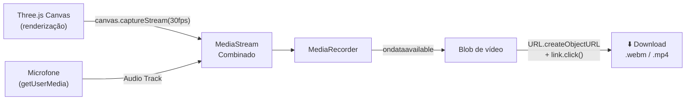

# 09 — Gravação de Vídeo

> [!NOTE] A funcionalidade de gravação é implementada no módulo `recorder.js` do [[05 - Frontend Web (Three.js)]]. Para configurar o ambiente de gravação, veja [[03 - Setup e Instalação]].

---

## 🎬 Como a Gravação Funciona

O sistema de gravação combina dois streams de mídia em um único arquivo de vídeo:



### Fluxo Técnico

1. **Captura do Canvas:** `canvas.captureStream(30)` gera um `MediaStream` com a renderização Three.js a 30fps
2. **Captura de Áudio:** `navigator.mediaDevices.getUserMedia({ audio: true })` captura o microfone
3. **Combinação:** As tracks de vídeo e áudio são combinadas em um único `MediaStream`
4. **Gravação:** `MediaRecorder` grava o stream em chunks de dados
5. **Download:** Ao parar, os chunks são combinados em um `Blob` e um link de download é gerado e clicado automaticamente

---

## 💻 Implementação (recorder.js)

```javascript
class Recorder {
    constructor(canvas) {
        this.canvas = canvas;
        this.mediaRecorder = null;
        this.chunks = [];
    }

    async start() {
        // 1. Capturar canvas
        const canvasStream = this.canvas.captureStream(30);

        // 2. Capturar áudio do microfone
        const audioStream = await navigator.mediaDevices.getUserMedia({ audio: true });

        // 3. Combinar streams
        const combinedStream = new MediaStream([
            ...canvasStream.getVideoTracks(),
            ...audioStream.getAudioTracks()
        ]);

        // 4. Iniciar gravação
        const mimeType = MediaRecorder.isTypeSupported('video/webm;codecs=vp9')
            ? 'video/webm;codecs=vp9'
            : 'video/mp4';

        this.mediaRecorder = new MediaRecorder(combinedStream, { mimeType });
        this.chunks = [];

        this.mediaRecorder.ondataavailable = (e) => {
            if (e.data.size > 0) this.chunks.push(e.data);
        };

        this.mediaRecorder.onstop = () => this.download();
        this.mediaRecorder.start(1000); // Chunk a cada 1 segundo
    }

    stop() {
        this.mediaRecorder?.stop();
    }

    download() {
        const blob = new Blob(this.chunks, { type: this.mediaRecorder.mimeType });
        const url = URL.createObjectURL(blob);
        const a = document.createElement('a');
        a.href = url;
        a.download = `facetomodel_${Date.now()}.webm`;
        a.click();
        URL.revokeObjectURL(url);
    }
}
```

---

## 🎵 Áudio: getUserMedia

A captura de áudio requer que o usuário conceda permissão ao microfone no browser:

- O browser exibirá um popup de permissão na primeira gravação
- Permissões ficam salvas por origem (`http://localhost:3000`)
- Para redefinir: **Chrome** → ícone de cadeado na URL → Permissões

> [!WARNING] `getUserMedia` só funciona em **contextos seguros** (HTTPS ou localhost). Se o FaceToModel estiver rodando em um servidor remoto (ex: IP do Mac acessado de outro dispositivo), será necessário HTTPS com certificado válido ou auto-assinado.

---

## 📁 Formatos de Saída

| Browser | Codec de Vídeo | Codec de Áudio | Extensão |
|---|---|---|---|
| **Chrome** | VP8 ou VP9 | Opus | `.webm` |
| **Firefox** | VP8 | Opus | `.webm` |
| **Safari** | H.264 | AAC | `.mp4` |
| **Edge** | VP8 / H.264 | Opus / AAC | `.webm` / `.mp4` |

> [!NOTE] O codec é selecionado automaticamente com base no que o browser suporta. Para forçar um formato específico, use `MediaRecorder.isTypeSupported('video/mp4')` antes de instanciar o recorder.

---

## 🔐 Permissões Necessárias

| Permissão | Quando é solicitada | Como verificar |
|---|---|---|
| **Microfone** | Ao clicar em "Gravar" pela primeira vez | `navigator.permissions.query({ name: 'microphone' })` |
| **Câmera** | Não necessária (usamos canvas, não câmera) | N/A |

---

## ⬇️ Fluxo de Download

O download ocorre automaticamente ao parar a gravação:

1. `MediaRecorder.stop()` é chamado
2. O evento `onstop` dispara
3. Todos os chunks são agrupados em um `Blob`
4. Um link `<a>` invisível é criado com `download="facetomodel_<timestamp>.webm"`
5. `.click()` é chamado programaticamente
6. O browser baixa o arquivo para a pasta Downloads padrão

> [!TIP] Para gravar vídeos longos sem consumir muita memória, o MediaRecorder usa `timeslice` (chunks a cada 1 segundo). Os chunks são descartados do buffer assim que armazenados no array `chunks`.

---

## ⚠️ Limitações Conhecidas

| Limitação | Detalhes | Solução |
|---|---|---|
| **Sem HTTPS em rede remota** | `getUserMedia` bloqueado em HTTP não-localhost | Configurar HTTPS no servidor |
| **Sem edição pós-gravação** | O vídeo é exportado como gravado, sem cortes | Editar externamente (iMovie, DaVinci, etc.) |
| **Sem vídeo externo** | Apenas o canvas é capturado, não a câmera do computador | Usar OBS para combinar fontes |
| **Duração ilimitada** | Gravações muito longas podem consumir muita RAM | Limite recomendado: ~30 min |

---

## 🔗 Veja Também

- [[05 - Frontend Web (Three.js)]] — Módulo `recorder.js` e estrutura do frontend
- [[03 - Setup e Instalação]] — Configuração do ambiente necessária para gravação
